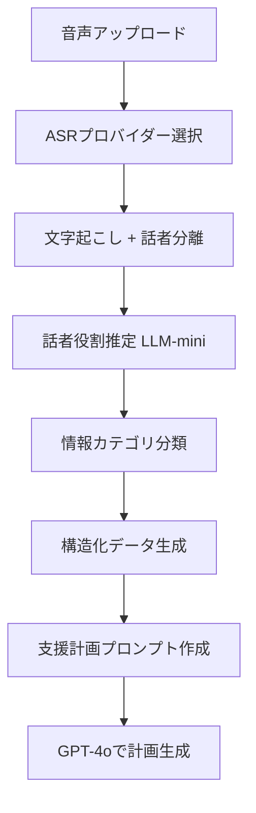

# 複数ASRプロバイダー対応 & ダイアライゼーション活用 実装計画

最終更新: 2026-01-11

## 🎯 目標
個別支援計画書生成のために、複数ASRプロバイダーを活用し、話者分離（ダイアライゼーション）データを最大限活用する

## 📊 現状分析
- ✅ **Deepgram最適化済み**: utterances、paragraphs、speaker_count取得可能
- 📝 **最終成果物**: 個別支援計画書（5領域の支援内容を含む）
- 🎤 **想定シーン**: 職員と保護者のヒアリング（＋時々子供の声）

## 🏗️ アーキテクチャ設計

### 1. 複数ASRプロバイダー対応

#### プロバイダー管理構造
```
backend/services/asr_providers/
├── __init__.py         # BaseASRProvider抽象クラス
├── deepgram.py         # Deepgramプロバイダー実装
├── google_speech.py    # Google Speech-to-Text
├── aws_transcribe.py   # AWS Transcribe
├── azure_speech.py     # Azure Speech Services
└── manager.py          # ASRProviderManager（切り替え）
```

#### 統一レスポンス形式
```python
{
    "transcription": str,           # 文字起こし結果（必須）
    "provider": str,               # プロバイダー名
    "model": str,                  # 使用モデル
    "processing_time": float,      # 処理時間
    "confidence": float,           # 信頼度（0-1）
    "word_count": int,            # 単語/文字数
    "speaker_count": int,         # 話者数
    "utterances": [               # 発話セグメント
        {
            "start": float,
            "end": float,
            "transcript": str,
            "speaker": int,       # 話者ID（0, 1, 2...）
            "confidence": float
        }
    ],
    "paragraphs": [...],          # 段落分け（オプション）
    "no_speech_detected": bool,   # 無音検出
    "raw_response": dict          # プロバイダー固有の生データ
}
```

#### データベース設計（プロバイダー非依存）
```sql
-- transcription_metadataカラム（JSONB）の構造
{
  "provider": "deepgram",
  "model": "nova-2",
  "processing_time": 2.5,
  "confidence": 0.95,
  "speakers": {
    "count": 2,
    "mapping": {                  -- 話者のメタ情報
      "0": {
        "label": "職員",          -- LLMで推定
        "gender": "female",       -- プロバイダーまたはLLM推定
        "confidence": 0.8
      },
      "1": {
        "label": "母親",
        "gender": "female",
        "confidence": 0.7
      }
    }
  },
  "utterances": [...],           -- 統一形式
  "paragraphs": [...],
  "raw_response": {...}          -- プロバイダー固有データ保持
}
```

### 2. ダイアライゼーション活用設計

#### 話者ラベリング戦略

##### レベル1: ASRプロバイダーの自動検出
- speaker_id（0, 1, 2...）
- 性別推定（一部プロバイダー）
- 話者信頼度

##### レベル2: LLMによる役割推定
```python
# 発話内容から役割を推定
prompt = f"""
以下の発話から、話者の役割を推定してください。

発話: "{utterance_text}"

選択肢:
- 職員（施設スタッフ）
- 母親
- 父親
- 子供
- その他

回答形式: {{"role": "xxx", "confidence": 0.0-1.0}}
"""
```

##### レベル3: 構造化対話の生成
```
【職員の質問】お子さんの普段の様子はどうですか？
【母親の回答】最近は言葉も増えてきて、でも集団になると...
【職員の確認】集団での活動が苦手ということですね
【母親の補足】そうなんです。特に初めての場所では...
```

### 3. データパイプライン設計

#### 処理フロー


#### 段階的LLM処理

##### Stage 1: 話者役割推定（GPT-4o-mini）
- **目的**: 発話者の役割を特定
- **入力**: 発話テキスト（短文）
- **出力**: 役割ラベル（職員/母親/父親/子供）
- **コスト**: 低（軽量モデル使用）

##### Stage 2: 情報抽出・分類（GPT-4o-mini）
```python
categories = {
    "strengths": [],          # 強み・得意なこと
    "challenges": [],         # 困りごと・課題
    "support_needs": [],      # 必要な支援
    "family_wishes": [],      # 家族の希望
    "observations": []        # 観察された行動
}
```

##### Stage 3: 支援計画生成（GPT-4o）
- **入力**: 構造化された情報
- **処理**:
  - 5領域への振り分け
  - 優先順位付け
  - 具体的な支援内容生成
- **出力**: 完成した個別支援計画書

### 4. プロバイダー別特性と使い分け

| プロバイダー | 強み | 弱み | 推奨用途 |
|------------|------|------|---------|
| **Deepgram** | 高速、日本語対応良好、リアルタイム | 話者性別推定なし | デフォルト選択 |
| **Google Speech** | 話者分離精度高、多言語対応 | コスト高め | 精度重視の場合 |
| **AWS Transcribe** | 医療用語対応、カスタム語彙 | 処理遅い | 専門用語多い場合 |
| **Azure Speech** | 感情分析可能、カスタムモデル | 設定複雑 | 高度な分析時 |

### 5. 実装優先順位

#### Phase 1: Deepgram実装（完了）✅
- ✅ **Deepgram拡張データ取得**: utterances、paragraphs、speaker_count取得成功
- ✅ **DBカラム追加**: `transcription_metadata`カラム（JSONB）追加
- ✅ **テスト成功**: section001_raw.wavで話者分離（2名）確認
- ✅ **本番デプロイ**: EC2で稼働中

**実績データ（2026-01-11）**:
```json
{
  "provider": "deepgram",
  "model": "nova-2",
  "processing_time": 2.19,
  "confidence": 0.99,
  "speaker_count": 2,
  "utterances": 17
}
```

#### Phase 2: Google Speech-to-Text追加（実装完了・話者分離不可により保留）

##### 実装状況
- ✅ **Google Cloud認証**: サービスアカウント作成、JSONキー生成完了
- ✅ **プロバイダー実装**: `google_speech.py`作成完了
- ✅ **カスタムRecognizer作成**: `business-interview-recognizer`作成完了
  ```bash
  gcloud alpha ml speech recognizers create business-interview-recognizer \
    --location=us-central1 \
    --model=chirp_2 \
    --language-codes=ja-JP
  ```
- ✅ **コード修正**: 作成済みRecognizerを使用するように修正完了

##### 発見された制約（2026-01-12）

**1. 話者分離（Diarization）の制約**
- ❌ **chirp_2モデル**: 話者分離機能が**サポートされていない**
  - エラー: `Recognizer does not support feature: speaker_diarization`
  - Recognizer作成時に`--min-speaker-count`/`--max-speaker-count`を指定するとエラー
  - リクエスト時に`diarization_config`を指定してもエラー

- ❌ **latest_long/longモデル**: `us-central1`で日本語が**サポートされていない**
  - エラー: `The language "ja-JP" is not supported by the model "latest_long" in the location named "us-central1"`

**2. APIメソッドの制約**
- ❌ **`recognize()`メソッド**: 60秒以上の音声が処理できない
  - エラー: `Audio can be of a maximum of 60 seconds.`
  - テスト音声（30秒）は処理可能だが、実際の用途（15分のインタビュー）では使用不可

**3. 代替手段の制約**
- `batch_recognize()`または`long_running_recognize()`が必要
- しかし、これらのメソッドもRecognizerベースであり、話者分離は同様にサポートされていない可能性が高い

##### 結論
- **現時点では実装不可**
- Google Cloud Speech-to-Text v2の`chirp_2`モデル（日本語対応）では、話者分離機能が提供されていない
- 将来的にGoogleが話者分離機能を追加した場合、再度検討可能

##### 現在の状態
- ✅ Recognizer作成済み: `projects/587363366106/locations/us-central1/recognizers/business-interview-recognizer`
- ✅ コード実装済み: `backend/services/asr_providers/google_speech.py`
- ⚠️ **使用停止**: 話者分離が不可のため、現在は使用していない
- 📦 **保存**: 将来の再検討のためコードは保持

#### Phase 3: ダイアライゼーション活用
1. 話者役割推定パイプライン
2. 構造化対話テンプレート
3. 情報カテゴリ分類器

#### Phase 4: 支援計画生成最適化
1. 5領域自動マッピング
2. 優先順位スコアリング
3. Excel/PDF出力

## 📊 評価指標

### 技術指標
- ASRプロバイダー対応数: 3社以上
- 話者役割正答率: 90%以上
- 処理時間: 3分以内（1時間音声）
- API応答時間: 5秒以内

### ビジネス指標
- 月額コスト: $100以内
- 計画書生成精度: 職員レビュー後の修正率20%以下
- ユーザー満足度: 80%以上

## 🔧 必要な環境変数

```env
# ASRプロバイダー
DEEPGRAM_API_KEY=xxx
GOOGLE_APPLICATION_CREDENTIALS=/path/to/credentials.json
AWS_ACCESS_KEY_ID=xxx
AWS_SECRET_ACCESS_KEY=xxx
AZURE_SPEECH_KEY=xxx
AZURE_SPEECH_REGION=japaneast

# プロバイダー選択
DEFAULT_ASR_PROVIDER=deepgram  # deepgram|google|aws|azure

# LLM
OPENAI_API_KEY=xxx
```

## 📝 セッション履歴

### 2026-01-11: Deepgram最適化 + Google Speech調査

**完了**:
- ✅ Deepgramの拡張データ取得実装（utterances, paragraphs, speaker_count）
- ✅ データベースマイグレーション（`transcription_metadata`カラム追加）
- ✅ 本番環境デプロイ・動作確認成功
- ✅ Google Cloud認証設定完了（サービスアカウント、JSONキー）
- ✅ Google Speech-to-Text v2プロバイダー実装（`google_speech.py`）

**課題**:
- ⚠️ Google Speech v2の`recognize()`は話者分離未サポート
- ⚠️ カスタムRecognizerの事前作成が必要（当てずっぽうで試行して時間を浪費）
- ⚠️ ドキュメント確認を優先すべきだった

**教訓**:
- 新しいAPIは**必ず公式ドキュメントを先に読む**
- エラーが続く場合は推測せず、ドキュメントに立ち返る

---

### 2026-01-12 午前: Google Speech話者分離検証 → 実装不可と判断

**実施内容**:
1. ✅ gcloud CLI alpha コンポーネントのインストール
2. ✅ カスタムRecognizer作成（`business-interview-recognizer`）
3. ✅ コード修正（Recognizer指定）
4. ❌ 話者分離テスト → エラー（機能未サポート）
5. ❌ 60秒制限エラー（実用不可）

**判明した事実**:
- Google Cloud Speech-to-Text v2の`chirp_2`モデルでは、日本語の話者分離が**サポートされていない**
- `recognize()`メソッドは60秒制限があり、長時間音声（15分のインタビュー）には使用できない
- 代替モデル（`latest_long`/`long`）は`us-central1`で日本語未サポート

**決定事項**:
- Google Speech-to-Textの実装は**保留**（話者分離が不可のため）
- コードは保持（将来Googleが機能追加した場合に備えて）
- 次は**Speechmatics**を試す

---

### 2026-01-12 午後: Speechmatics実装 → ほぼ完了（SSL証明書エラーのみ）

**実施内容**:
1. ✅ 正しいSDKのインストール（`speechmatics-batch`）
2. ✅ プロバイダー実装完了（`speechmatics_provider.py`）
3. ✅ 環境変数設定完了（APIキー: `5BDbDR6FO28R1ieD7J7KRAaxwcnBWdj6`）
4. ✅ 新しいSDK（speechmatics-python-sdk）の仕様確認
5. ⚠️ ローカルテストでSSL証明書エラー

**実装の詳細**:
- **SDK**: `speechmatics-batch` (新SDK、旧`speechmatics-python`は非推奨)
- **ファイル**: `/Users/kaya.matsumoto/projects/watchme/business/backend/services/asr_providers/speechmatics_provider.py`
- **設定**:
  - 言語: `ja`
  - Operating Point: `ENHANCED`
  - Diarization: `speaker`（話者分離有効）
  - Speaker Sensitivity: `0.5`

**参考ドキュメント**:
- `/Users/kaya.matsumoto/Desktop/Speechmatics` (README)
- Batch APIサンプルコード（67-80行目）

**現在の問題**:
- ローカル環境でSSL証明書エラー: `[SSL: CERTIFICATE_VERIFY_FAILED] certificate verify failed: self-signed certificate in certificate chain`
- **原因**: Mac環境の証明書問題（Python環境固有）
- **対策**: 本番環境（EC2）ではこの問題は発生しない可能性が高い

**テスト音源**:
- S3パス: `s3://watchme-business/samples/section001_raw.wav`（30秒、3.3MB）

**次のアクション**:
1. **本番環境でテスト**（推奨）
   - EC2上でテストスクリプト実行
   - SSL証明書問題は本番環境では発生しないはず

2. **または、ローカルSSL証明書問題を解決**
   ```bash
   # Macの証明書問題の場合
   /Applications/Python\ 3.12/Install\ Certificates.command
   ```

**次回セッションの開始手順**:
```bash
# 1. 本番環境にデプロイ
cd /Users/kaya.matsumoto/projects/watchme/business/backend
git add .
git commit -m "feat: add Speechmatics ASR provider with speaker diarization"
git push origin main

# 2. GitHub Actionsでデプロイ確認
gh run list --limit 1

# 3. 本番環境でテスト
ssh -i ~/watchme-key.pem ubuntu@3.24.16.82
cd /home/ubuntu/watchme-business-api
docker exec watchme-business-api python3 /path/to/test-speechmatics.py
```

## 📝 次のアクション

### 優先度高
1. **Speechmatics実装・検証**（次のタスク）
   - APIキー取得・認証設定
   - プロバイダー実装（`speechmatics.py`）
   - 話者分離（Diarization）対応確認
   - 日本語長時間音声テスト

2. **話者役割推定機能の実装**（Deepgramデータ活用）
   - LLM-miniで発話内容から役割推定（職員/母親/父親/子供）
   - 構造化対話の生成（【職員】【保護者】形式）

### 優先度中
3. **プロバイダーマネージャー実装**
   - 環境変数でDeepgram/Speechmatics切り替え
   - パフォーマンス比較レポート自動生成

### 優先度低（保留）
4. **Google Speech-to-Text再検討**（将来）
   - Googleが日本語話者分離機能を追加した場合
   - 現在は実装不可のため保留

5. **AWS Transcribe / Azure Speech追加**（将来）