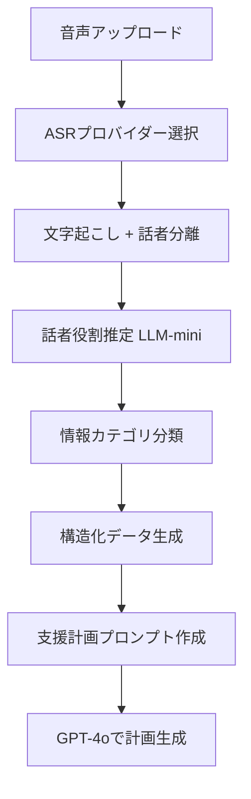

# 複数ASRプロバイダー対応 & ダイアライゼーション活用 実装計画

最終更新: 2026-01-11

## 🎯 目標
個別支援計画書生成のために、複数ASRプロバイダーを活用し、話者分離（ダイアライゼーション）データを最大限活用する

## 📊 現状分析
- ✅ **Deepgram最適化済み**: utterances、paragraphs、speaker_count取得可能
- 📝 **最終成果物**: 個別支援計画書（5領域の支援内容を含む）
- 🎤 **想定シーン**: 職員と保護者のヒアリング（＋時々子供の声）

## 🏗️ アーキテクチャ設計

### 1. 複数ASRプロバイダー対応

#### プロバイダー管理構造
```
backend/services/asr_providers/
├── __init__.py         # BaseASRProvider抽象クラス
├── deepgram.py         # Deepgramプロバイダー実装
├── google_speech.py    # Google Speech-to-Text
├── aws_transcribe.py   # AWS Transcribe
├── azure_speech.py     # Azure Speech Services
└── manager.py          # ASRProviderManager（切り替え）
```

#### 統一レスポンス形式
```python
{
    "transcription": str,           # 文字起こし結果（必須）
    "provider": str,               # プロバイダー名
    "model": str,                  # 使用モデル
    "processing_time": float,      # 処理時間
    "confidence": float,           # 信頼度（0-1）
    "word_count": int,            # 単語/文字数
    "speaker_count": int,         # 話者数
    "utterances": [               # 発話セグメント
        {
            "start": float,
            "end": float,
            "transcript": str,
            "speaker": int,       # 話者ID（0, 1, 2...）
            "confidence": float
        }
    ],
    "paragraphs": [...],          # 段落分け（オプション）
    "no_speech_detected": bool,   # 無音検出
    "raw_response": dict          # プロバイダー固有の生データ
}
```

#### データベース設計（プロバイダー非依存）
```sql
-- transcription_metadataカラム（JSONB）の構造
{
  "provider": "deepgram",
  "model": "nova-2",
  "processing_time": 2.5,
  "confidence": 0.95,
  "speakers": {
    "count": 2,
    "mapping": {                  -- 話者のメタ情報
      "0": {
        "label": "職員",          -- LLMで推定
        "gender": "female",       -- プロバイダーまたはLLM推定
        "confidence": 0.8
      },
      "1": {
        "label": "母親",
        "gender": "female",
        "confidence": 0.7
      }
    }
  },
  "utterances": [...],           -- 統一形式
  "paragraphs": [...],
  "raw_response": {...}          -- プロバイダー固有データ保持
}
```

### 2. ダイアライゼーション活用設計

#### 話者ラベリング戦略

##### レベル1: ASRプロバイダーの自動検出
- speaker_id（0, 1, 2...）
- 性別推定（一部プロバイダー）
- 話者信頼度

##### レベル2: LLMによる役割推定
```python
# 発話内容から役割を推定
prompt = f"""
以下の発話から、話者の役割を推定してください。

発話: "{utterance_text}"

選択肢:
- 職員（施設スタッフ）
- 母親
- 父親
- 子供
- その他

回答形式: {{"role": "xxx", "confidence": 0.0-1.0}}
"""
```

##### レベル3: 構造化対話の生成
```
【職員の質問】お子さんの普段の様子はどうですか？
【母親の回答】最近は言葉も増えてきて、でも集団になると...
【職員の確認】集団での活動が苦手ということですね
【母親の補足】そうなんです。特に初めての場所では...
```

### 3. データパイプライン設計

#### 処理フロー


#### 段階的LLM処理

##### Stage 1: 話者役割推定（GPT-4o-mini）
- **目的**: 発話者の役割を特定
- **入力**: 発話テキスト（短文）
- **出力**: 役割ラベル（職員/母親/父親/子供）
- **コスト**: 低（軽量モデル使用）

##### Stage 2: 情報抽出・分類（GPT-4o-mini）
```python
categories = {
    "strengths": [],          # 強み・得意なこと
    "challenges": [],         # 困りごと・課題
    "support_needs": [],      # 必要な支援
    "family_wishes": [],      # 家族の希望
    "observations": []        # 観察された行動
}
```

##### Stage 3: 支援計画生成（GPT-4o）
- **入力**: 構造化された情報
- **処理**:
  - 5領域への振り分け
  - 優先順位付け
  - 具体的な支援内容生成
- **出力**: 完成した個別支援計画書

### 4. プロバイダー別特性と使い分け

| プロバイダー | 強み | 弱み | 推奨用途 |
|------------|------|------|---------|
| **Deepgram** | 高速、日本語対応良好、リアルタイム | 話者性別推定なし | デフォルト選択 |
| **Google Speech** | 話者分離精度高、多言語対応 | コスト高め | 精度重視の場合 |
| **AWS Transcribe** | 医療用語対応、カスタム語彙 | 処理遅い | 専門用語多い場合 |
| **Azure Speech** | 感情分析可能、カスタムモデル | 設定複雑 | 高度な分析時 |

### 5. 実装優先順位

#### Phase 1: 基盤整備（実装中）
- ✅ Deepgram拡張データ取得
- ✅ DBカラム追加（transcription_metadata）
- 🔄 ASRプロバイダー基底クラス作成
- 🔄 Deepgramプロバイダーのリファクタリング

#### Phase 2: Google Speech-to-Text追加
1. Google Cloud認証設定
2. Google Speechプロバイダー実装
3. プロバイダー切り替え機能
4. コスト・精度比較機能

#### Phase 3: ダイアライゼーション活用
1. 話者役割推定パイプライン
2. 構造化対話テンプレート
3. 情報カテゴリ分類器

#### Phase 4: 支援計画生成最適化
1. 5領域自動マッピング
2. 優先順位スコアリング
3. Excel/PDF出力

## 📊 評価指標

### 技術指標
- ASRプロバイダー対応数: 3社以上
- 話者役割正答率: 90%以上
- 処理時間: 3分以内（1時間音声）
- API応答時間: 5秒以内

### ビジネス指標
- 月額コスト: $100以内
- 計画書生成精度: 職員レビュー後の修正率20%以下
- ユーザー満足度: 80%以上

## 🔧 必要な環境変数

```env
# ASRプロバイダー
DEEPGRAM_API_KEY=xxx
GOOGLE_APPLICATION_CREDENTIALS=/path/to/credentials.json
AWS_ACCESS_KEY_ID=xxx
AWS_SECRET_ACCESS_KEY=xxx
AZURE_SPEECH_KEY=xxx
AZURE_SPEECH_REGION=japaneast

# プロバイダー選択
DEFAULT_ASR_PROVIDER=deepgram  # deepgram|google|aws|azure

# LLM
OPENAI_API_KEY=xxx
```

## 📝 次のアクション

1. **ASRプロバイダー基底クラス実装**
2. **Deepgramプロバイダーのリファクタリング**
3. **プロバイダーマネージャー実装**
4. **Google Speech-to-Text統合**
5. **話者役割推定機能の実装**