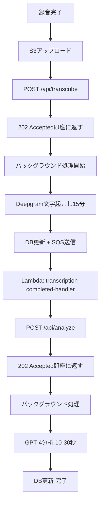

# 非同期処理アーキテクチャ 実装計画書

**作成日**: 2026-01-11
**対象プロジェクト**: WatchMe Business API
**目的**: 1時間の音声処理に対応、堅牢なイベント駆動型システム構築

---

## 🎯 目標

- ✅ タイムアウトなし（15分の処理でもOK）
- ✅ 確実に次の処理へ進む
- ✅ フロントエンドに依存しない
- ✅ リトライ機能あり

---

## 🏗️ アーキテクチャ（WatchMeパターン）

### 全体フロー



---

## 📦 必要なコンポーネント

### 1. SQSキュー（2つ）

```bash
# キュー1: 文字起こし完了通知
aws sqs create-queue \
  --queue-name business-transcription-completed-queue \
  --region ap-southeast-2

# キュー2: 分析完了通知（将来用）
aws sqs create-queue \
  --queue-name business-analysis-completed-queue \
  --region ap-southeast-2
```

### 2. Lambda関数（2つ）

#### Lambda 1: business-transcription-completed-handler

**トリガー**: SQS `business-transcription-completed-queue`

**処理内容**:
```python
def lambda_handler(event, context):
    # 1. SQSメッセージからsession_idを取得
    # 2. POST /api/analyze を呼び出し
    # 3. 成功したらSQSメッセージを削除
```

**環境変数**:
- `API_BASE_URL`: https://api.hey-watch.me/business
- `API_TOKEN`: watchme-b2b-poc-2025

#### Lambda 2: business-analysis-completed-handler（将来用）

**トリガー**: SQS `business-analysis-completed-queue`

**処理内容**: 将来の拡張用（Excel生成など）

### 3. API非同期化

#### POST /api/transcribe の修正

**Before（同期型）**:
```python
@app.post("/api/transcribe")
async def transcribe_audio():
    # ここで処理完了まで待つ
    result = await asr_service.transcribe_audio(...)
    return result
```

**After（非同期型）**:
```python
@app.post("/api/transcribe")
async def transcribe_audio():
    # 1. DBステータスを 'processing' に更新
    # 2. バックグラウンドタスク開始
    # 3. 202 Acceptedを即座に返す
    return Response(status_code=202, content={"status": "processing"})

# バックグラウンドタスク
def background_transcribe(session_id: str):
    # 1. Deepgram処理
    # 2. DB更新
    # 3. SQS送信
    boto3.client('sqs').send_message(
        QueueUrl=TRANSCRIPTION_QUEUE_URL,
        MessageBody=json.dumps({"session_id": session_id})
    )
```

#### POST /api/analyze の実装（新規・非同期型）

```python
@app.post("/api/analyze")
async def analyze_interview():
    # 1. DBステータスを 'analyzing' に更新
    # 2. バックグラウンドタスク開始
    # 3. 202 Acceptedを即座に返す
    return Response(status_code=202)

# バックグラウンドタスク
def background_analyze(session_id: str):
    # 1. プロンプト生成
    # 2. GPT-4実行
    # 3. DB更新
    # 4. SQS送信（将来用）
```

---

## 🗄️ DB設計

### statusカラムの拡張

```sql
-- 現在
status TEXT CHECK (status IN ('recording', 'processing', 'completed', 'failed'))

-- 変更後
status TEXT CHECK (status IN (
  'recording',
  'uploaded',
  'transcribing',
  'transcribed',
  'analyzing',
  'completed',
  'failed'
))
```

### 新規カラム追加

```sql
ALTER TABLE business_interview_sessions
ADD COLUMN analysis_prompt TEXT,
ADD COLUMN analysis_result JSONB,
ADD COLUMN error_message TEXT;

COMMENT ON COLUMN business_interview_sessions.analysis_prompt IS 'Generated prompt for GPT-4';
COMMENT ON COLUMN business_interview_sessions.analysis_result IS 'GPT-4 analysis result';
COMMENT ON COLUMN business_interview_sessions.error_message IS 'Error message if processing failed';
```

---

## 📝 実装ステップ

### Phase 1: SQS + Lambda セットアップ

1. **SQSキュー作成**
   ```bash
   aws sqs create-queue \
     --queue-name business-transcription-completed-queue \
     --region ap-southeast-2
   ```

2. **Lambda関数作成**
   - ディレクトリ: `/Users/kaya.matsumoto/projects/watchme/business/lambda/`
   - `transcription-completed-handler/`
     - `lambda_function.py`
     - `requirements.txt`

3. **Lambda→SQSの接続**
   - Lambdaトリガー設定: SQSキュー

### Phase 2: API非同期化

1. **FastAPIバックグラウンドタスク実装**
   - `services/background_tasks.py` 作成
   - `transcribe_background()`
   - `analyze_background()`

2. **SQS送信機能追加**
   - boto3クライアント初期化
   - send_message実装

3. **エンドポイント修正**
   - POST /api/transcribe → 202 Accepted
   - POST /api/analyze → 新規実装

### Phase 3: DBカラム追加

```sql
ALTER TABLE business_interview_sessions
ADD COLUMN analysis_prompt TEXT,
ADD COLUMN analysis_result JSONB,
ADD COLUMN error_message TEXT;

-- statusのCHECK制約を更新
ALTER TABLE business_interview_sessions
DROP CONSTRAINT IF EXISTS business_interview_sessions_status_check;

ALTER TABLE business_interview_sessions
ADD CONSTRAINT business_interview_sessions_status_check
CHECK (status IN ('recording', 'uploaded', 'transcribing', 'transcribed', 'analyzing', 'completed', 'failed'));
```

### Phase 4: テスト

1. **ローカルテスト**: 構文チェックのみ
2. **本番テスト**:
   ```bash
   # 1. 録音アップロード
   # 2. POST /api/transcribe → 202 Accepted確認
   # 3. DBステータス確認（transcribing → transcribed）
   # 4. Lambda実行確認
   # 5. DBステータス確認（analyzing → completed）
   ```

---

## 🔧 環境変数

### API側（docker-compose.prod.yml）

```yaml
environment:
  - SQS_TRANSCRIPTION_QUEUE_URL=${SQS_TRANSCRIPTION_QUEUE_URL}
  - SQS_ANALYSIS_QUEUE_URL=${SQS_ANALYSIS_QUEUE_URL}
```

### Lambda側

```
API_BASE_URL=https://api.hey-watch.me/business
API_TOKEN=watchme-b2b-poc-2025
```

---

## 📊 ステータス遷移

```
録音開始      → status: 'recording'
S3アップロード → status: 'uploaded'
文字起こし開始 → status: 'transcribing'
文字起こし完了 → status: 'transcribed'
分析開始      → status: 'analyzing'
分析完了      → status: 'completed'
エラー発生    → status: 'failed' + error_message
```

---

## 🎯 WatchMeとの違い

| 項目 | WatchMe | Business API |
|------|---------|--------------|
| 並列処理 | 3つのAPI（ASR/SED/SER） | 1つ（ASRのみ） |
| 完了チェック | aggregator-checker | 不要（Lambdaが直接次実行） |
| トリガー | S3 Event | 手動（将来は自動化可能） |

---

## 🚀 次のセッションでの実装順序

1. SQSキュー作成
2. Lambda関数作成
3. API非同期化（POST /api/transcribe修正）
4. POST /api/analyze 実装
5. DBカラム追加
6. デプロイ＆テスト
