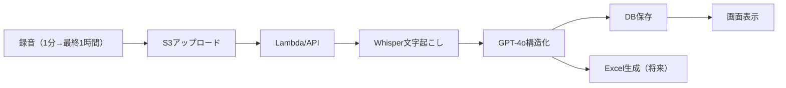

# 児童発達支援事業所 DXプラットフォーム 実装計画書

最終更新: 2026-01-10

## 📋 プロジェクト概要

### ビジョン
児童発達支援事業所の全業務をデジタル化し、職員の負担軽減と支援の質向上を実現

### 第1弾：個別支援計画書の自動生成（POC）
保護者ヒアリング音声（約1時間）から、AI分析により個別支援計画書を自動生成

---

## 🎯 個別支援計画書の構造（リタリコ様式ベース）

### 必須項目

```yaml
基本情報:
  - 利用児氏名
  - 生年月日
  - 年齢
  - 作成年月日

利用児及び家族の生活に対する意向:
  - 本人の意向
  - 保護者の意向

総合的な支援の方針:
  - 現在の状況分析
  - 支援の基本方針
  - 連携方法

長期目標:
  - 期間: 6ヶ月
  - 内容: 全体的な到達目標

短期目標:
  - 期間: 3ヶ月
  - 内容: 具体的な到達目標

支援内容（5領域）:
  1. 健康・生活
  2. 運動・感覚
  3. 認知・行動
  4. 言語・コミュニケーション
  5. 人間関係・社会性

各支援項目:
  - 支援目標（具体的な到達目標）
  - 支援内容（提供上のポイント）
  - 達成時期（3ヶ月/6ヶ月）
  - 担当者
  - 留意事項
  - 優先順位（1-3）
```

---

## 🏗️ システムアーキテクチャ

### 技術スタック

| レイヤー | 技術 | 理由 |
|---------|------|------|
| **フロントエンド** | React + TypeScript + Vite | PWA対応、高速ビルド |
| **バックエンド** | FastAPI（Python 3.11） | 高速、AI連携しやすい |
| **音声処理** | Groq Whisper v3 | 日本語精度高い、高速 |
| **LLM** | OpenAI GPT-4o | 日本語理解力、構造化能力 |
| **データベース** | Supabase（既存プロジェクト） | 認証機能付き、リアルタイム |
| **ストレージ** | S3（シドニー） | 既存EC2と同リージョン |
| **インフラ** | 既存EC2（シドニー） | t4g.large、Docker環境構築済み |

### データフロー



---

## 📁 プロジェクト構造

```
/projects/watchme/business/
├── docs/                    # 計画書・仕様書
│   └── IMPLEMENTATION_PLAN.md（このファイル）
├── infrastructure/
│   ├── s3/                 # S3バケット設定
│   └── supabase/           # DB設計
├── backend/                 # FastAPI
│   ├── app.py
│   ├── services/
│   │   ├── transcription.py    # Whisper連携
│   │   ├── llm_processor.py    # GPT-4o処理
│   │   └── plan_generator.py   # 計画書生成
│   └── docker/
│       └── Dockerfile
└── frontend/               # React PWA
    ├── src/
    │   ├── pages/
    │   │   ├── RecordingPage.tsx
    │   │   └── PlanViewPage.tsx
    │   └── components/
    └── public/
```

---

## 💾 データ設計

### S3バケット構成

```
watchme-business/（新規バケット・シドニーリージョン）
├── recordings/              # ヒアリング音声
│   └── {facility_id}/
│       └── {child_id}/
│           └── {yyyy-mm-dd}/
│               └── {session_id}.webm
├── transcriptions/          # 文字起こし結果
│   └── {facility_id}/
│       └── {session_id}.json
└── plans/                   # 生成された計画書
    └── {facility_id}/
        └── {child_id}/
            └── {yyyy-mm-dd}_plan.json
```

### Supabaseテーブル設計（既存プロジェクト内にプレフィックス付きで追加）

**⚠️ 重要**: 新規スキーマではなく、既存プロジェクトの `public` スキーマ内に `business_` プレフィックス付きテーブルを作成

**理由**: Supabaseは2プロジェクトまで無料。POC段階では既存プロジェクトを活用。

```sql
-- 事業所マスタ
CREATE TABLE public.business_facilities (
  id UUID PRIMARY KEY DEFAULT gen_random_uuid(),
  name TEXT NOT NULL,
  address TEXT,
  phone TEXT,
  created_at TIMESTAMPTZ DEFAULT NOW()
);

-- 児童情報
CREATE TABLE public.business_children (
  id UUID PRIMARY KEY DEFAULT gen_random_uuid(),
  facility_id UUID REFERENCES public.business_facilities(id) ON DELETE CASCADE,
  name TEXT NOT NULL,
  birth_date DATE,
  created_at TIMESTAMPTZ DEFAULT NOW()
);

-- ヒアリングセッション
CREATE TABLE public.business_interview_sessions (
  id UUID PRIMARY KEY DEFAULT gen_random_uuid(),
  facility_id UUID NOT NULL,
  child_id UUID REFERENCES public.business_children(id) ON DELETE CASCADE,
  s3_audio_path TEXT,
  transcription TEXT,        -- Whisper結果
  status TEXT DEFAULT 'recording',  -- recording, processing, completed
  duration_seconds INTEGER,
  recorded_at TIMESTAMPTZ DEFAULT NOW(),
  created_at TIMESTAMPTZ DEFAULT NOW()
);

-- 個別支援計画
CREATE TABLE public.business_support_plans (
  id UUID PRIMARY KEY DEFAULT gen_random_uuid(),
  session_id UUID REFERENCES public.business_interview_sessions(id) ON DELETE CASCADE,
  child_id UUID REFERENCES public.business_children(id) ON DELETE CASCADE,

  -- 基本情報
  child_name TEXT,
  birth_date DATE,
  age_years INTEGER,
  age_months INTEGER,

  -- 意向
  child_intention TEXT,
  family_intention TEXT,

  -- 支援方針
  general_policy TEXT,
  long_term_goal TEXT,
  long_term_period TEXT DEFAULT '6ヶ月',
  short_term_goal TEXT,
  short_term_period TEXT DEFAULT '3ヶ月',

  -- 支援内容（JSONB形式で5領域を格納）
  support_details JSONB,
  /*
  {
    "health_life": [
      {
        "goal": "目標",
        "content": "支援内容",
        "period": "3ヶ月",
        "staff": "担当者",
        "notes": "留意事項",
        "priority": 1
      }
    ],
    "motor_sensory": [...],
    "cognitive_behavior": [...],
    "language_communication": [...],
    "social_relationships": [...]
  }
  */

  -- 管理情報
  created_by UUID,
  approved_by UUID,
  created_at TIMESTAMPTZ DEFAULT NOW(),
  updated_at TIMESTAMPTZ DEFAULT NOW()
);

-- RLS（Row Level Security）ポリシー
-- POC段階では全アクセス許可（将来的に認証実装）
ALTER TABLE public.business_facilities ENABLE ROW LEVEL SECURITY;
ALTER TABLE public.business_children ENABLE ROW LEVEL SECURITY;
ALTER TABLE public.business_interview_sessions ENABLE ROW LEVEL SECURITY;
ALTER TABLE public.business_support_plans ENABLE ROW LEVEL SECURITY;

CREATE POLICY "Allow all access for POC" ON public.business_facilities FOR ALL USING (true);
CREATE POLICY "Allow all access for POC" ON public.business_children FOR ALL USING (true);
CREATE POLICY "Allow all access for POC" ON public.business_interview_sessions FOR ALL USING (true);
CREATE POLICY "Allow all access for POC" ON public.business_support_plans FOR ALL USING (true);
```

---

## 🔄 処理フロー詳細

### Phase 1: POC（1分音声）

```python
# 1. 音声アップロード
POST /api/upload
{
  "audio": file,
  "facility_id": "poc-001",
  "child_id": "child-001"
}

# 2. Whisper文字起こし（Groq API）
transcription = groq.audio.transcribe(
  model="whisper-large-v3",
  file=audio_file,
  language="ja"
)

# 3. GPT-4o構造化
prompt = f"""
以下の保護者ヒアリング内容から、個別支援計画書の要素を抽出してください。

ヒアリング内容：
{transcription}

以下の形式でJSONとして出力してください：
{{
  "child_intention": "本人の意向",
  "family_intention": "保護者の意向",
  "current_status": "現在の状況",
  "strengths": "強み・得意なこと",
  "challenges": "困りごと・課題",
  "support_needs": {{
    "health_life": ["必要な支援"],
    "motor_sensory": ["必要な支援"],
    "cognitive_behavior": ["必要な支援"],
    "language_communication": ["必要な支援"],
    "social_relationships": ["必要な支援"]
  }}
}}
"""

# 4. DB保存 & 表示
```

### Phase 2: 長尺対応（1時間音声）

- **分割処理**: 10分ごとにチャンク分割
- **並列処理**: 複数チャンクを同時処理
- **結合処理**: GPT-4oで全体を統合

---

## 📊 スケール想定

| 項目 | 初期（POC） | 6ヶ月後 | 1年後 |
|------|------------|---------|-------|
| 事業所数 | 1-5 | 20 | 100 |
| 児童数/事業所 | 15 | 15 | 30 |
| 録音頻度 | 週2-3回 | 週5回 | 週10回 |
| 音声長さ | 1分 | 30分 | 60分 |
| 月間処理数 | 50 | 400 | 4,000 |

### コスト試算（月額）

| 項目 | 料金 |
|------|------|
| S3ストレージ | $10（100GB想定） |
| Groq API | 無料枠内 |
| OpenAI GPT-4o | $50（4,000回 × 2,000トークン） |
| 既存EC2活用 | $0（追加なし） |
| **合計** | **約$60/月** |

---

## 🚀 実装ステップ

### Step 1: 基盤構築（1週目）
- [x] プロジェクト構造作成
- [ ] S3バケット作成（watchme-business）
- [ ] Supabaseテーブル作成
- [ ] FastAPI基本構造

### Step 2: 音声処理（2週目）
- [ ] 録音UI実装
- [ ] S3アップロード
- [ ] Groq Whisper連携
- [ ] 文字起こし結果表示

### Step 3: AI分析（3週目）
- [ ] GPT-4oプロンプト設計
- [ ] 構造化処理実装
- [ ] DB保存処理

### Step 4: UI実装（4週目）
- [ ] 計画書表示画面
- [ ] 編集機能（簡易）
- [ ] Excel出力（オプション）

---

## 🔐 セキュリティ・コンプライアンス

### 個人情報保護
- 音声データ：永続保存（将来的に保存期間ポリシー検討）
- アクセスログ：全操作を記録
- 暗号化：S3は暗号化、DBは既存Supabase設定準拠

### 認証（POC段階）
- 固定APIトークン方式
- 将来的にSupabase Auth統合

---

## 📝 備考

### 既存システムとの関係
- B2C（WatchMe）とは完全分離
- APIキー（Groq, OpenAI）は共有可能
- EC2リソースは共有（Dockerコンテナで分離）

### 今後の拡張
- 日々の観察記録
- 連絡帳機能
- 請求業務自動化
- 保護者向けアプリ

---

## ✅ 次のアクション

1. **S3バケット作成**（watchme-business）
2. **Supabaseスキーマ作成**（businessスキーマ）
3. **Groq/OpenAI APIキー確認**
4. **プロトタイプ実装開始**